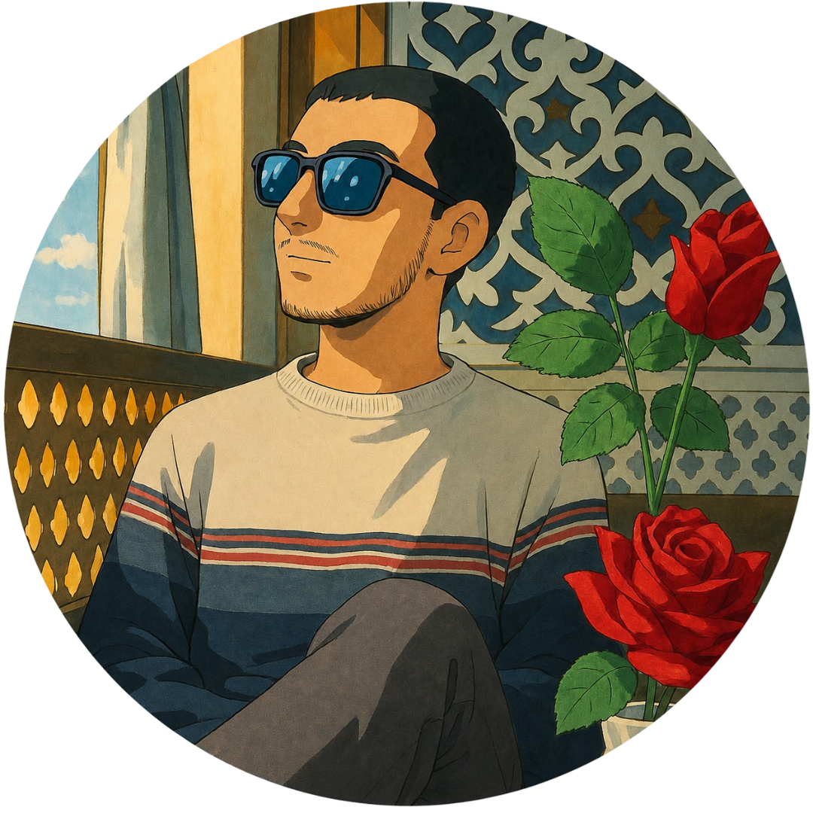

<div align="center">

<p align="center">
  
</p>

# Anish Dangal

### Backend-Oriented MERN Stack Developer


</div>

---

## 🚀 About Me

```yaml
Name: Anish Dangal
Role: Backend-Oriented Full Stack Developer
Location: Nepal
Education: BSc (Hons) Computing
Focus:
  - Backend Architecture
  - REST APIs
  - Real-Time Systems
  - Database Design
Current Goal:
  - Building Production-Grade Scalable Applications
